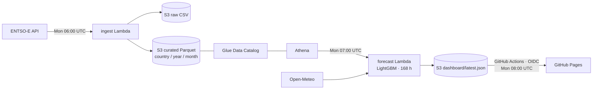

# European Electricity Load Forecasting on AWS

A serverless lakehouse that ingests ENTSO-E grid load for six European bidding
zones, forecasts the next 168 hours with LightGBM, and republishes a static
dashboard every Monday — for well under a dollar a month.

**[→ Live dashboard](https://jcarlosrv.github.io/aws-energy-lakehouse/)**



## Results

The model is scored against a seasonal naive baseline — last week, same hour —
over eight held-out weeks, retrained on 190,921 rows.

| Metric | LightGBM | Seasonal naive (168 h) | Improvement |
|---|---|---|---|
| MAE | 1,322.63 MW | 1,967.40 MW | **32.8 %** |
| RMSE | 1,820.35 MW | 2,616.62 MW | 30.4 % |
| MAPE | 3.72 % | 5.62 % | 1.90 pp |

Features are lagged load, 168-hour rolling mean and standard deviation, calendar
terms, and four Open-Meteo weather variables per country.

## Query cost: 256× less data scanned

Athena bills by bytes scanned, so the storage layout *is* the cost model. The
same question — average German load in July 2026 — against the same 744 rows,
returning the same answer (51,406.5669 MW):

| Layout | Bytes scanned |
|---|---|
| Unpartitioned CSV | 1,787,790 |
| Partitioned Parquet | **6,985** |

**256× less, a 99.6 % reduction.** Decomposing it matters more than the headline:

| Effect | Factor |
|---|---|
| Columnar format and column projection | 1.07× |
| Partition pruning | 239× |

Partitioning is doing essentially all of the work. The columnar format
contributes almost nothing here, because the table is two columns wide and there
is little left to project away. The Parquet copy is in fact *larger* on disk than
the CSV — 4.2 MB against 1.8 MB — since 78 small partitions each pay a file
footer. Splitting the layout win from the format win is the difference between a
number that survives review and one that does not.

`benchmark/scan_benchmark.sql` reproduces every figure above.

## Design decisions

**The dashboard never queries AWS.** The forecast Lambda writes a JSON payload to
S3; a GitHub Actions job assumes a read-only role via OIDC, commits the file, and
Pages serves it. Visitors cost nothing and there is no billable surface for
anyone to abuse.

**Nothing runs in a VPC.** A NAT gateway would cost roughly 30× the entire
budget. Both functions reach the internet directly.

**Credentials live in SSM Parameter Store**, as a SecureString — Secrets Manager
charges $0.40 per secret per month.

**Partitions are hand-written DDL**, not a Glue crawler, which bills per run for
a schema that is known in advance.

**Two alarms, one topic.** Lambda `Errors` on each function feeds an SNS topic
with a confirmed subscription. They have fired on a real upstream outage and
delivered.

## Correctness guardrails

- Load values outside 0–120,000 MW are dropped before they reach the curated layer.
- Partition writes are read-modify-write, de-duplicated on timestamp, so a re-run
  over an overlapping window is idempotent.
- The forecast refuses to run on history older than 72 hours rather than
  publishing a confident extrapolation from stale inputs.
- If no country yields data, the run fails loudly instead of writing an empty
  dashboard.
- The published payload is schema-validated in CI before it is committed.

## Stack

S3 · Glue Data Catalog · Athena · Lambda (Zip and container image via ECR) ·
EventBridge · SSM Parameter Store · CloudWatch alarms · SNS · GitHub Actions with
OIDC role assumption · GitHub Pages.

## Layout

```
src/          ingest, forecast, features, Athena and weather clients
train/        offline model training
tests/        33 tests, no live AWS calls
infra/        IAM policies, lifecycle rules, EventBridge targets
benchmark/    the scan-cost comparison
docs/         the published dashboard
```

## Running the tests

```bash
python -m venv .venv && .venv/Scripts/activate
pip install -r requirements-dev.txt
pytest
```

## Coverage note

Six zones are ingested — Germany, France, Spain, Italy, Poland and the
Netherlands. Five are forecast; the Netherlands has no weather anchor city
configured, so it is carried in the lakehouse but excluded from the model.

## License

MIT — see [LICENSE](LICENSE).
